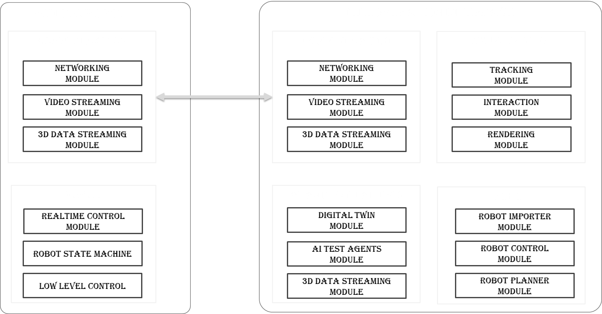

# 2026 Summer School on Telerobotics and Cyborg Technologies

#Olmo UI concepts for Teleoperators

- Theoretical part of UI design ≈(2.5 hours):
- User-Centred Design
- Gestalt Principles of Design
- Atomic design method
- 10 Usability Heuristics for User Interface Design
- Dark mode UI design

#Mohammad and Yonas about unreal

