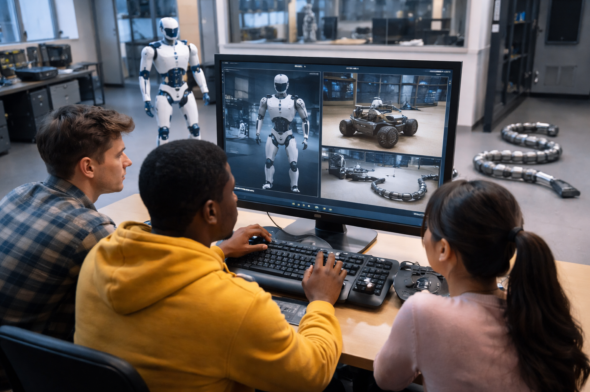

# Telepresence, Teleoperation, and Interfaces

This documentation supports the software used in the telepresence and teleoperation workflow. Before launching the user interface, it is useful to distinguish three closely related ideas: **teleoperation**, **telepresence**, and **interfaces for telepresence and teleoperation**.

**Teleoperation** refers to the control of a machine, robot, or remote system from a distance. In a teleoperation scenario, a human operator sends commands to a remote device and receives feedback from sensors, cameras, robot state, or other data streams. The main goal is to enable the operator to act on a remote environment without being physically located there.

**Telepresence** builds on teleoperation by focusing on the operator's experience of being situated in the remote environment. Marvin Minsky's early writing on telepresence described systems that allow people to work through remote-controlled machines in places that may be distant, dangerous, inaccessible, or impractical to visit directly. Thomas Sheridan's work further connected telepresence to the idea that sensing, display, and control technologies can make an operator feel present at a remote or virtual site.

A useful distinction is:

> **Teleoperation enables remote action; telepresence aims to make that remote action feel situated, informed, and embodied.**

In practice, telepresence is not created by a single camera stream or a single control command. It emerges from the combination of sensing, communication, control, feedback, timing, embodiment, and interface design. Research on presence and telepresence has emphasized that the operator's experience is both technical and perceptual: the system must transmit useful information, but it must also present that information in a way that supports attention, awareness, decision-making, and control.

For this reason, the **user interface** is a central part of any telepresence and teleoperation system. The interface is where the operator perceives the remote environment, interprets robot state, selects actions, monitors risk, and closes the loop between intention and remote execution. A good interface does more than expose buttons or data streams: it helps the operator build a reliable mental model of what the robot is doing, what the remote environment contains, what actions are available, and what consequences those actions may have.

In this documentation, the UI is introduced as the operator-facing layer of the telepresence system. It connects the user to the robot, simulator, communication middleware, and available control modes. The goal of the following pages is to help users understand how to launch the interface, connect it to the underlying software components, interpret the information shown on screen, and use the available controls safely and effectively.

This is a joint effort between the IEEE Systems, Man, and Cybernetics Society, the Future Directions Initiative on Telepresence, and the Robotics and Automation Society.

